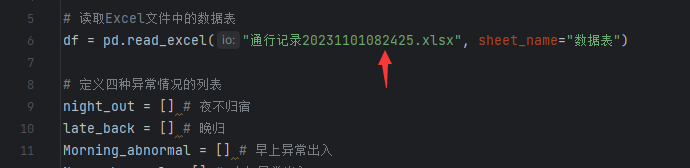

# <font color= "#66CCFF">一个简易的书院查房程序.py</font> <br />
#### Email：XUZIXIAN13579@foxmail.com
#### Powerby：@晓风P
### <font color= "#DDDD00">本程序编写/执行环境</font> <br />
```
    1.Python 3.10
    2.pandas（pip install pandas -i https://pypi.tuna.tsinghua.edu.cn/simple）
    3.openpyxl（pip install openpyxl -i https://pypi.tuna.tsinghua.edu.cn/simple）
    4.Pycharm
```
### <font color= "#DDDD00">本程序目前可以实现的功能</font> <br />
```
    1.排查夜不归宿的名单
    2.排查晚归的名单（可自行修改时间节点）
    3.排查早上异常出入人员（早上不刷闸机就跑路了的）
    4.排查中午异常出入人员（中午以后没有出入记录的）
```
### <font color= "#DDDD00">本程序目前的缺陷</font> <br />
```
    1.由于数据库混乱所以无法识别出教职工与学生，一网打尽（狗头保命）
```
## <font color= "00B050">如何执行本程序</font> <br />
### <font color= "#66CCFF">数据表格预处理</font> <br />
```
    1.FCR人脸识别系统默认导出的数据表是根据时间节点乱序的，同时带有较多的“空白”记录。
    2.导出表格后需要先进行人名的排序，优先级是人名，第二优先是同行时间，从上往下为“升序”
    3.请确保表格第一行的顺序为：姓名、用户类型、班级、职务、通行门点、出入类型、通行时间（其他的不重要，主要检查这几个）
    3.调用筛选，把空白的记录整行删除，注意，是“整行删除”!!!!!!
    4.保存表格
    （以上可以参考本工程下的“已处理”中的表格处理）
```
### <font color= "#66CCFF">开始查房罢（喜）</font> <br />
1.推荐使用Pycharm打开该工程目录。\
2.将处理好的表格放入到工程文件夹的目录下。\
3.使用Pycharm打开find.py（根据注意事项选择STT和FTS文件）文件，修改第五行的代码为你的表格文件。\
<font color= "#DD0000">注意:findSTT.py适用于周日至周四的表格、findFTS.py适用于周五至周六的表格\
（判定晚归的时间节点不一样）</font> <br />

<font color= "#66CCFF">示例：\
读取Excel文件中的数据表\
df = pd.read_excel("XXXXXXXXXXXXXXXXX.xlsx", sheet_name="数据表")
</font> <br />
<font color= "#EE0000">(XXXXXXXXXXXXXXXX就是你的文件名称)\
</font> <br />


4.确保这一切完成后，你就可以执行find.py了，正常情况下1w条数据1min内会出结果(会在控制台输出)

### <font color= "#EE0000">注意事项</font> <br />
1.在执行完程序后根目录下会生成Result.xlsx表格，请把处理完的Result表格重命名或者移去别的地方，否则再处理下个表格时会直接覆盖。\
2.相关的实例表格已经存放于本目录下的demo文件夹，处理表格时可参考相关的示例。

最后，祝各位好运
